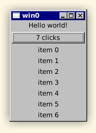

behold one of my dumbest ideas ever

index.js:

```js
import m from './mithril.js';

let count = 0;

const Hello = {
    view() {
        const els = [
            'Hello world!',
            m('button', { onclick: () => count++ }, count + ' clicks'),
        ];
        for (let i = 0; i < count; i++) {
            els.push('item ' + i);
        }
        return m('vbox', els);
    },
};

m.mount(document.body, Hello);
```

```sh
$ make
$ ./main
```



quickjs + mithril + custom dom bindings to gtk3

js interpreter is embedded in the binary, so it's a single executable that just links against glibc, gtk, etc., easiest distribution ever!

and the binaries are super small.

```sh
$ make RELEASE=1
$ strip main
$ du -h main
812K    main
```
